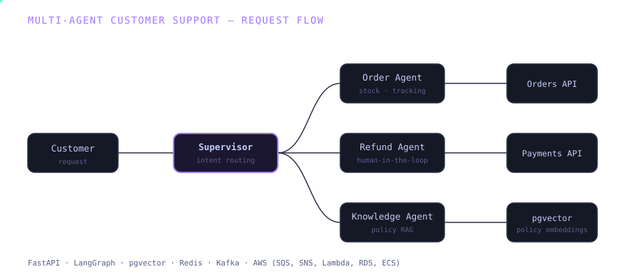

  

## ✨ About Me

* 🏗️ Backend engineer with **5+ years shipping production systems end-to-end** — cloud-native, event-driven backends through to multi-agent LLM systems
* 📈 Grew at **Dotless** from Software Engineer to **Tech Lead**, now leading engineering on an AI-powered fintech product
* 💳 Own architecture decisions on an **AI-powered financial-advisory SaaS**, integrating Open Finance (Pluggy) for secure, real-time bank-data ingestion
* ⚡ Design **Kafka + Redis + PostgreSQL** pipelines that process financial transactions at scale
* 🤖 Shipped **three multi-agent systems to production this year** — orchestration, tool calling, RAG, observability
* 🎯 Care about the parts most AI demos skip: retrieval quality, cost/latency trade-offs, observability, and knowing when *not* to reach for an LLM

## 🤖 AI Systems I've Shipped

**🎧 Multi-agent customer support** — Supervisor, Order, Refund, and Knowledge agents resolving customer requests end-to-end: stock lookups, policy RAG, payment API calls, refunds, and human escalation.
`FastAPI · LangGraph · pgvector · Redis · Kafka · AWS (SQS, SNS, Lambda, RDS, ECS)`

**🔍 Research & reporting pipeline** — Planner → specialist agents (web research, data analysis, competitor) → Critic → Writer, turning open questions into evidence-backed reports with per-claim source and confidence tracking.
`Python · LangGraph · RAG · SQL tools · AWS (Lambda, RDS, S3)`

**🚨 Production incident-response agent** — Diagnoses incidents from metrics/logs/traces, forms and tests hypotheses, and executes fixes with human-in-the-loop approval on high-risk actions. **Diagnosed a Redis pool-exhaustion incident, cutting error rate from 31.8% → 0.7%.**
`Python · Kafka · Redis · PostgreSQL · RAG · AWS (ECS, EKS, SQS, SNS)`

## 💻 Core Tech Stack

<!-- mantenha exatamente as seções de badges do seu README atual aqui -->

## 🧭 Experience

<!-- Dotless + Realtor, como no README anterior -->

## 🎓 Education & Languages

**B.Sc. in Computer Science** · 2022 – 2025

🇧🇷 Portuguese (native) · 🇺🇸 English (highly proficient)

### ✍️ Dev Quote

